# **ARTERA**

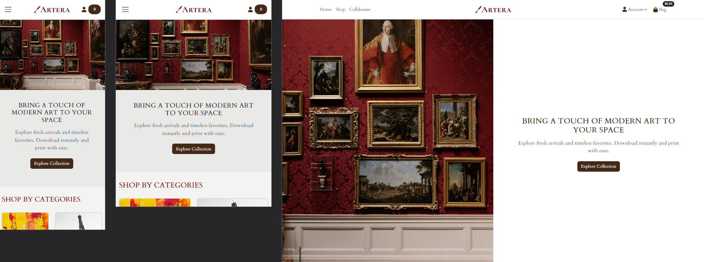
[View live project here!](https://artera-d6829bf39792.herokuapp.com/)

Artera is a digital art e‑commerce platform built with **Django**, **Bootstrap 5**, **JavaScript**, and **Stripe**. Users can browse artworks, choose sizes with dynamic pricing, purchase securely, manage profiles, and access all purchased files through a personal Digital Library. Artists can also submit custom artwork requests or offer sample work.

Card number for payment testing: 4242424242424242

[Resumbittion fixes](#resubmition-fixes).

## Content:

* [User Goals](#user-goals)
* [Business Goals](#business-goals)
* [Developer Goals](#developer-goals)
* [User Stories](#user-stories)
* [Agile Methods](#agile-methods)
* [Business Model](#business-model)
* [Web Marketing](#web-marketing)
* [Information Architecture](#information-architecture)
* [Design Choices](#design-choices)
* [Features](#features)
* [UX Design](#ux-design)
* [Technologies Used](#technologies-used)
* [Testing](#testing)
* [Bugs](#bugs)
* [Future Changes](#future-changes)
* [Deployment](#deployment)
* [Setup Instructions](#setup-instructions)
* [Cloning, Forking and Version Control](#cloning-forking-and-version-control)
* [Credits](#credits)

## Resubmition fixes
### Authentication & Email Verification

#### Issue  
User authentication was failing during deployment with an `SMTPServerDisconnected` error. Even with correct credentials, the login process crashed when attempting to send emails.

#### Cause  
The project uses **Django Allauth**, which needs a working email backend for authentication and verification. An expired **SendGrid SMTP API key** caused the SMTP connection to close unexpectedly, blocking the authentication flow. I used trial version for the SendGrid which sadly expired before the project was assessed.

#### Solution  
- Bought a SendGrid subscription for the API key to work 
- Verified the SMTP connection 
- Confirmed successful email delivery for authentication and verification

#### Result  
- Login and registration function correctly  
- Email verification is sent and received  
- Authentication no longer fails due to SMTP errors  

This was a production-level configuration issue rather than a problem with the authentication logic itself.

## User Goals

Artera helps users discover high‑quality downloadable art prints and purchase them easily. Users want:

* A clean, modern browsing experience
* Clear artwork previews, sizes, and pricing
* Smooth, secure checkout
* Access to previously purchased files
* Ability to request custom artwork or submit their own

## Business Goals

Artera is designed as a polished, real‑world e‑commerce platform that demonstrates full‑stack development skill and product thinking.
The project aims to:

* Present a professional, portfolio‑ready example of a complete Django e‑commerce application.
* Showcase the ability to design, build, and deploy production‑level features end‑to‑end.
* Deliver a smooth, trustworthy user experience with clean UI and consistent behavior.
* Provide a scalable base for future additions like artist dashboards, subscriptions, or analytics tools.

## Developer Goals

* Build a fully functional e‑commerce platform using Django, Stripe, Bootstrap 5, and custom JavaScript.
* Ensure the site is fully responsive and visually consistent across all devices.
* Write clean, maintainable, and scalable code following best practices.
* Optimize backend and frontend performance for fast rendering and smooth interactions.
* Create a future‑proof structure that can grow with new features, artwork categories, or business models.

## User Stories

### 1. Sign-Up  
**User Story:**  
As a new user, I want to create an account so that I can purchase and later access my digital prints.  

**Acceptance Criteria:**  
- Sign-up form with email, username, and password  
- Redirects to home after successful registration  
- Errors shown for duplicate email or mismatched passwords  

---

### 2. Login  
**User Story:**  
As a returning user, I want to log in so I can securely view my purchases and downloads.  

**Acceptance Criteria:**  
- Login with email/username and password  
- Redirects to home on success  
- Error message on invalid credentials  
- Protected pages require login  
- Session persists until logout  
- “Forgot Password?” option sends reset email  

---

### 3. Browse Shop  
**User Story:**  
As a visitor, I want to browse available digital art prints so I can explore what’s for sale.  

**Acceptance Criteria:**  
- Grid of artworks with thumbnails, titles, and prices  
- Clicking an item opens the artwork detail page  
- Category filter  
- Search bar for titles/keywords  

---

### 4. Artwork Detail & Add to Cart  
**User Story:**  
As a user, I want to view artwork details and add them to my cart.  

**Acceptance Criteria:**  
- Large preview, description, and price displayed  
- “Add to Cart” updates cart dynamically  

---

### 5. Cart & Checkout  
**User Story:**  
As a user, I want to review my cart and pay securely.  

**Acceptance Criteria:**  
- Cart lists items with title, price, and remove option 
- Total price updates automatically  
- Checkout button redirects to Stripe  
- Success page after payment  

---

### 6. Stripe Payment Confirmation 
**User Story:**  
As the system, I want to confirm payment success so users only access paid items.  

**Acceptance Criteria:**  
- Stripe webhook validates successful payments  
- Order status becomes “paid” on confirmation  
- Failed payments remain “awaiting payment”  

---

### 7. My Library  
**User Story:**  
As a logged-in user, I want to access and download my purchased artworks.  

**Acceptance Criteria:**  
- List of all purchased artworks under paid orders  
- Only the buyer can access download links  

---

### 8. Profile Management  
**User Story:**  
As a logged-in user, I want to update my profile so my information is correct for purchases.  

**Acceptance Criteria:**  
- Editable fields: name, address, city, postal code, country  
- Validation ensures required fields  
- Confirmation message after saving  

---

### 9. Artist Offers  
**User Story:**  
As an artist, I want to offer my artwork to the platform for review.  

**Acceptance Criteria:**  
- Form with title, description, category, price, image upload
- After submission redirects to confirmation page

---

### 10. Custom Artwork Requests  
**User Story:**  
As a customer, I want to request custom artwork tailored to my preferences.  

**Acceptance Criteria:**  
- Form with title, description, and reference image  
- Requests linked to user account  
- Displayed in “My Requests”  
- As default shows stsus - "In review", status will be change by admin if accepted, or rejected.

---

### 11. Email Notifications  
**User Story:**  
As a user, I want to receive email notifications for important actions.  

**Acceptance Criteria:**  
- Email verification after registering new user 
- Email verification after changing email on profile page 
- Order confirmation email after payment  


## Agile Methods

This project was planned and developed using Agile methodology to keep development structured, transparent, and iterative.

- **User Stories:**  
  All core features of Artera were defined as user stories with clear acceptance criteria.  
  Each story received a priority label — *Must Have*, *Should Have*, or *Could Have* — ensuring the most important functionality was delivered first.

- **Project Planning:**  
  A GitHub Projects Kanban board was used with columns for **To Do**, **In Progress**, **Done**, and **Future Improvements**.  
  This provided a clear overview of progress and helped maintain development flow.

- **Iterative Development:**  
  Features were built in small, incremental steps.  
  Core e-commerce functionality (shop, bag, checkout, orders) was implemented first, followed by profile management, library features, and service-related tools (requests and offers).

- **Testing & Refinement:**  
  Each feature was manually tested after implementation.  
  Issues were addressed immediately before moving on to the next task, ensuring stable builds at every stage.

**Project Planning Screenshots**

  


## Business Model
The Business Model is **B2C**, meaning Artera sells digital art prints directly to individual customers.  
There is no physical inventory, no shipping, and no logistics. Instead, the focus is on delivering **high-quality downloadable artwork** that users can access instantly through their personal Library.

### A Persona Summary of the Customer

Artera is designed for individuals who want to elevate their personal space with clean, modern digital prints.  

Typical users:

- young professionals decorating apartments,
- people setting up home offices or creative corners,
- renters who want flexible, affordable decor,
- anyone who wants fast, downloadable art rather than waiting for shipping.

These users value:

- simplicity,  
- modern aesthetics,  
- instant access,  
- safe storage in a personal Library,  
- and a clean, minimal shopping experience.

### A Persona Summary of Artists / Contributors

Artera also serves emerging or independent artists who wish to:

- submit sample work for collaboration,
- contribute to a curated digital catalog,
- expand their reach through a premium, minimal brand.

Artist submissions are handled through a dedicated **Artwork Offer** form.

### Strategy Trade-Off

Artera intentionally trades a huge marketplace model for a **highly curated, calmer experience**.

Key trade-offs:

- fewer artworks → stronger identity and easier navigation,
- randomised print on the shop page - users see nes=w prints every time,
- digital-only files → no printing, packaging, or shipping costs,
- minimal UI → fewer distractions, more focus on art,
- must be logged in → ensures secure, reliable access to purchased files.

This strategy positions Artera as a clean, boutique digital art shop rather than a large cluttered store.


## Web Marketing

Artera includes several marketing and engagement features to grow the audience and keep users informed.

### 1. On-Site Communication
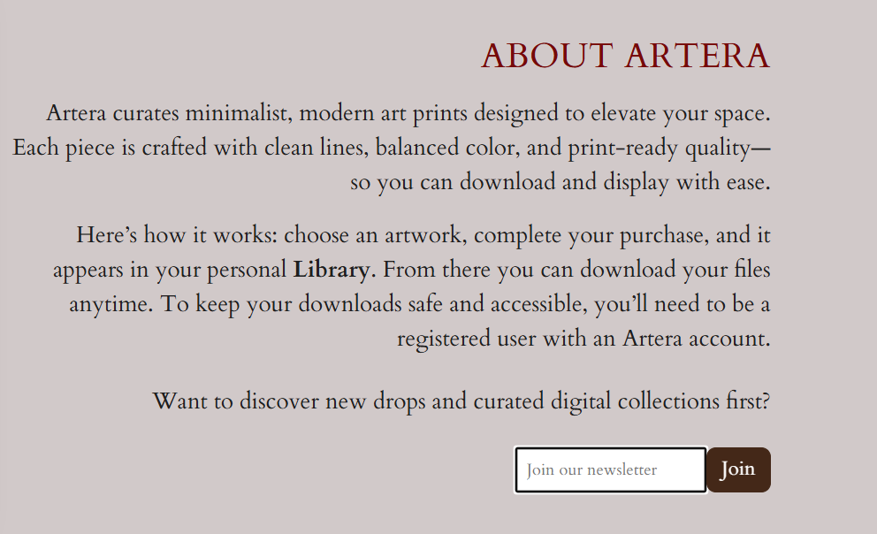

A large part of Artera’s marketing is built directly into the website:

- Messaging clearly explains that all products are **digital downloads**, not physical prints.
- The **About ARTERA** section outlines how purchases work:
  - choose an artwork,
  - purchase securely,
  - access the files in your **Library**.
- Calls-to-action guide users to **explore prints** or **create an account**, especially when not authenticated.

This ensures users understand how the platform operates and encourages account creation.

### 2. Newsletter

Artera includes a simple newsletter system that allows visitors to subscribe using their email address.

The newsletter is intended for:

- announcements of new collections,
- curated drops and seasonal sets,
- future promotions or discount periods,

Subscription forms appear in the About section.

### 3. Social Media

Because Artera is a visual-first brand, social platforms are essential for building trust and driving users back to the store.

#### **Facebook**

Artera’s Facebook page showcases the brand with a clean, modern aesthetic.  
It features:

- Branded cover + profile image  
- A clear, simple “About” section  
- A team-focused intro post to humanize the brand  
- Visual posts highlighting new prints  
- Direct pathways back to the store for browsing, registering, or purchasing  

**Facebook Page Mockup:**  
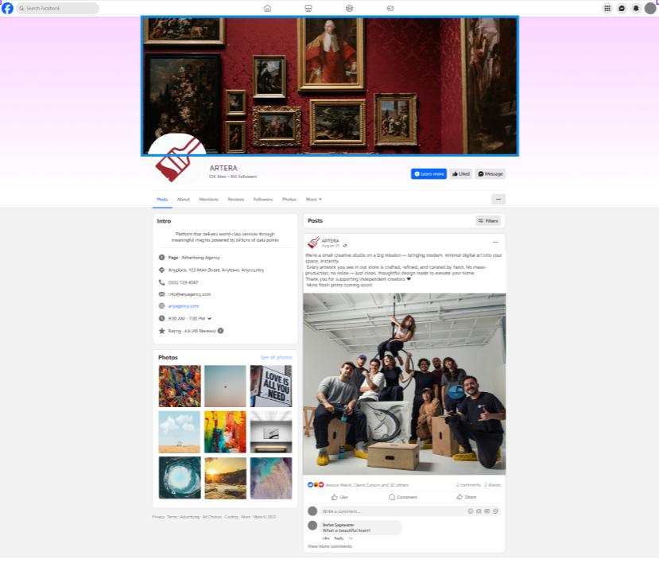

### 4. SEO Structure

Artera uses:

- clean URLs,
- descriptive artwork detail pages,
- consistent titles and meta structure,
- text-based categories and searchable descriptions.

## Information Architecture

### Database

- During development, Artera uses **SQLite** as the primary database.
- In production, the project is configured to use **PostgreSQL** when a `DATABASE_URL` environment variable is available.
- All core data (users, profiles, artworks, orders, custom requests, offers, newsletter subscriptions) is stored in relational tables with clear foreign-key relationships.

---

### Entity-Relationship Diagram

The database schema centers around the authenticated **User**, extending outward into the core e-commerce models for artworks, carts, orders, and service submissions.

The structure was designed using **dbdiagram.io** to clearly map out model relationships early in development.

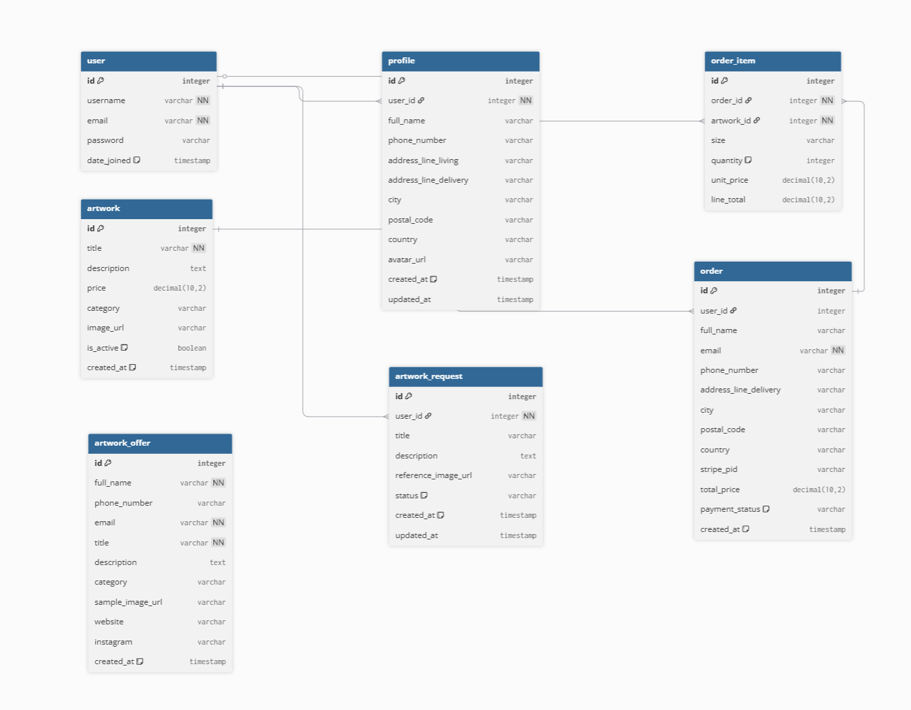

### Model Relationships

- **User → Profile**  
  One user to one profile

- **User → Order**  
  One user to many orders

- **Order → OrderItem**  
  One order to many order items

- **Artwork → OrderItem**  
  One artwork to many order items

- **User → ArtworkRequest**  
  One user to many artwork requests

- **User → ArtworkOffer**  
  One user to many artwork offers

---

### Data Modeling

Below is a summary of the most important models in Artera.

---

### **Profile Model**

A profile is created for each registered user and stores contact details, addresses, and avatar.

| Name                  | Database Key           | Field Type         | Validation / Notes                                    |
|-----------------------|------------------------|--------------------|------------------------------------------------------|
| user                  | user                   | OneToOneField      | `User`, `on_delete=models.CASCADE`                   |
| full name             | full_name              | CharField          | `max_length=100`, `blank=True`                       |
| phone number          | phone_number           | CharField          | `max_length=20`, `blank=True`                        |
| delivery address      | address_line_delivery  | CharField          | `max_length=255`, `blank=True`                       |
| living address        | address_line_living    | CharField          | `max_length=255`, `blank=True`                       |
| city                  | city                   | CharField          | `max_length=100`, `blank=True`                       |
| postal code           | postal_code            | CharField          | `max_length=20`, `blank=True`                        |
| country               | country                | CharField          | `max_length=100`, `blank=True`                       |
| county / region       | county                 | CharField          | `max_length=100`, `blank=True`                       |
| avatar                | avatar                 | CloudinaryField    | `blank=True`, `null=True`, stored in `avatars/`      |
| created at            | created_at             | DateTimeField      | `auto_now_add=True`                                  |
| updated at            | updated_at             | DateTimeField      | `auto_now=True`                                      |

Additional logic:

- Users can update their **username** and **email** from the profile page.
- Email changes are verified via **django-allauth** email confirmation.
- Avatars are stored on **Cloudinary** and physically deleted via `cloudinary.uploader.destroy` when removed.

---

### **Artwork Model**

Represents a single digital artwork available for purchase.

| Name          | Database Key | Field Type      | Validation / Notes                           |
|---------------|-------------|-----------------|----------------------------------------------|
| name          | name        | CharField       | Unique name of the artwork                   |
| description   | description | TextField       | Long-form description of the print           |
| category      | category    | ForeignKey      | Category model, `on_delete=models.CASCADE`   |
| price         | price       | DecimalField    | Base price of the artwork                    |
| image         | image       | CloudinaryField | Main image used across the site              |
| created at    | created_at  | DateTimeField   | `auto_now_add=True`                          |
| updated at    | updated_at  | DateTimeField   | `auto_now=True`                              |

Notes:

- Artworks are displayed in a **randomized order** on the shop page to improve discovery.
- Different print sizes are handled at the view/form level using a set of predefined options.

---

### **Category Model**

Used to group artworks (e.g. Abstract, Minimal, Nature, Typography).

| Name          | Database Key | Field Type   | Validation / Notes                   |
|---------------|-------------|--------------|--------------------------------------|
| name          | name        | CharField    | Category name, e.g. “Minimal”        |
| friendly name | friendly_name | CharField  | Display name for templates (optional) |

Categories are used on the homepage, shop filters, and artwork detail pages.

---

### **Order Model**

Represents a completed checkout. Used to populate the **Library** and to validate downloads.

| Name                 | Database Key   | Field Type      | Validation / Notes                           |
|----------------------|----------------|-----------------|----------------------------------------------|
| user                 | user           | ForeignKey      | `User`, `on_delete=models.SET_NULL`, nullable|
| full name            | full_name      | CharField       | Delivery / billing name                      |
| email                | email          | EmailField      | Used to link Library and confirmation email  |
| phone number         | phone_number   | CharField       | Contact number                               |
| address line 1       | street_address1| CharField       | First address line                           |
| address line 2       | street_address2| CharField       | Second address line (optional)               |
| city                 | town_or_city   | CharField       | City / town                                  |
| county / region      | county         | CharField       | Region / state (optional)                    |
| country              | country        | CharField       | Country                                      |
| postcode             | postcode       | CharField       | Postal code                                  |
| date                 | date           | DateTimeField   | `auto_now_add=True`                          |
| order number         | order_number   | CharField       | Unique identifier, non-editable              |
| stripe pid           | stripe_pid     | CharField       | Stripe PaymentIntent ID                      |
| original bag         | original_bag   | TextField       | JSON snapshot of the bag at checkout         |
| order total          | order_total    | DecimalField    | Sum of all line items                        |
| grand total          | grand_total    | DecimalField    | Equal to `order_total` (no delivery cost)    |

Notes:

- Delivery is **always digital**, so there are no shipping fields or delivery calculation logic.
- Orders are visible in the user’s **Library** after successful Stripe payment.

---

### **OrderItem Model**

Links a single purchased artwork (and size) to an Order.

| Name          | Database Key  | Field Type    | Validation / Notes                         |
|---------------|---------------|--------------|--------------------------------------------|
| order         | order         | ForeignKey   | `Order`, `related_name='lineitems'`        |
| artwork       | artwork       | ForeignKey   | `Artwork`, `on_delete=models.CASCADE`      |
| artwork size  | artwork_size  | CharField    | Chosen print size (e.g. A4, A3, 50×70 cm)  |
| quantity      | quantity      | IntegerField | Positive integer, typically `1`            |
| lineitem total| lineitem_total| DecimalField | Calculated at save time                    |

OrderItem records are used both for **Library display** and for validating download access per line item.

---

### **ArtworkRequest Model**

Stores a customer’s request for a fully custom artwork.

| Name          | Database Key | Field Type      | Validation / Notes                             |
|---------------|-------------|-----------------|------------------------------------------------|
| user          | user        | ForeignKey      | `User`, `on_delete=models.CASCADE`             |
| title         | title       | CharField       | Short title for the request                    |
| description   | description | TextField       | Details of what the customer wants             |
| reference image | reference_image | CloudinaryField | Optional visual reference                 |
| status        | status      | CharField       | Choices: `in_review`, `accepted`, `rejected`   |
| created at    | created_at  | DateTimeField   | `auto_now_add=True`                            |
| updated at    | updated_at  | DateTimeField   | `auto_now=True`                                |

Requests are accessible in the user’s **Library** and editable by the user until processed.

---

### **ArtworkOffer Model**

Allows external artists to submit their work or express interest in collaborating.

| Name          | Database Key | Field Type   | Validation / Notes                      |
|---------------|-------------|-------------|-----------------------------------------|
| full name     | full_name   | CharField   | Artist’s name                           |
| email         | email       | EmailField  | Contact email                           |
| phone number  | phone_number| CharField   | Optional phone contact                  |
| title         | title       | CharField   | Title of the proposal / sample artwork  |
| description   | description | TextField   | Description of style / concept          |
| category      | category    | CharField   | Suggested category (e.g. Minimal, Abstract) |
| sample image  | sample_image_url | URLField | Link to portfolio or sample image       |
| created at    | created_at  | DateTimeField | `auto_now_add=True`                    |

The admin uses this model to review potential collaborations and expand the catalog.

---

### **NewsletterSubscription Model**

Stores email addresses of users who opt in to receive art updates and news.

| Name       | Database Key | Field Type   | Validation / Notes                   |
|------------|-------------|-------------|--------------------------------------|
| email      | email       | EmailField  | `unique=True`                        |
| created at | created_at  | DateTimeField | `auto_now_add=True`                |
| is active  | is_active   | BooleanField | `default=True`                      |

Newsletter signups are available from the homepage and footer.

---

### Bag & Session Data

Artera does **not** store the shopping bag in a database table.  


## Design Choices

Artera was designed with a clean, minimal, gallery-style look that puts artwork at the center of the user experience.  
All layout decisions prioritize clarity, responsiveness, and fast browsing across devices.

### **Wireframes**
The project was planned using **Visily** wireframes to define structure before applying styling.

During the development process, the initial wireframes served as a strong foundation, but the visual direction naturally evolved as the project grew.  
Some early ideas were simplified or removed to maintain a clean user experience, while several new elements were added once real usage patterns became clear.

**Homepage Wireframes:**

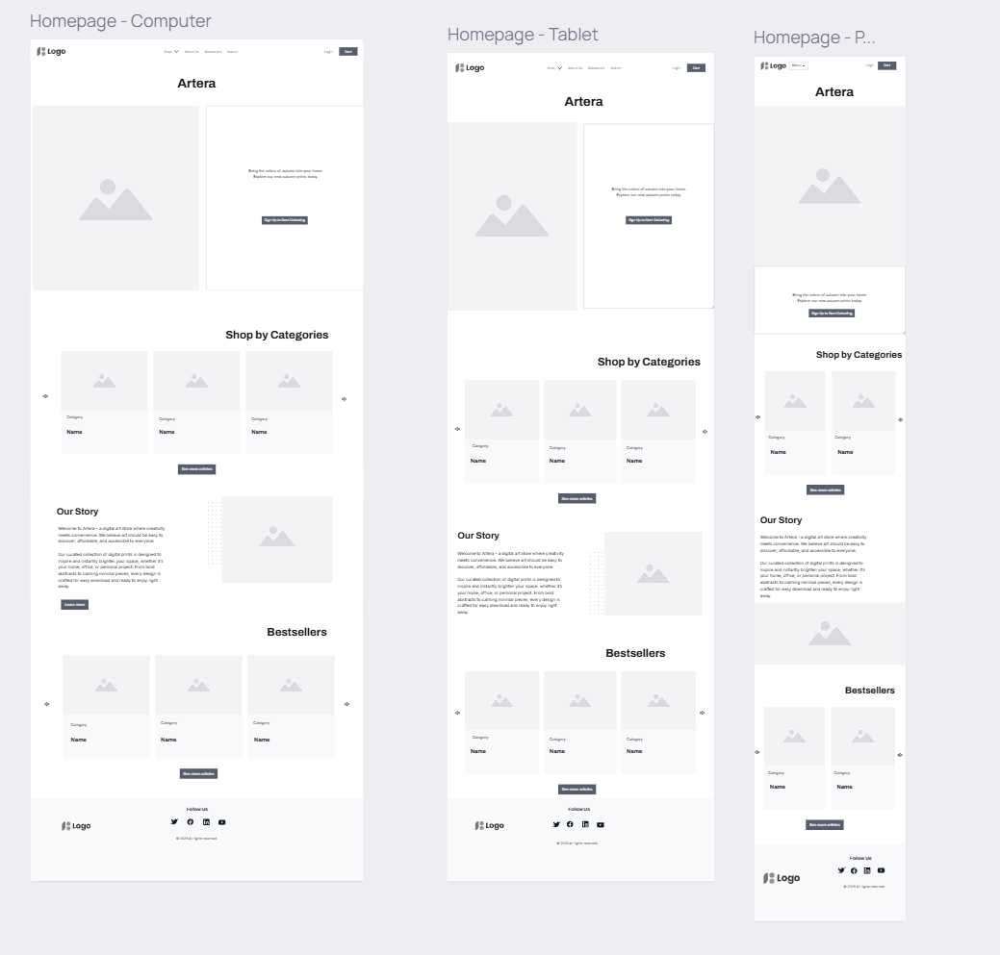

**Artwork Detail Wireframes:**

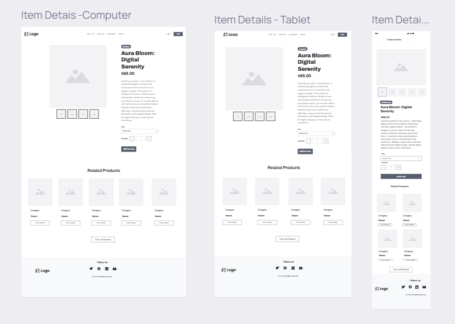

**Shop Page Wireframes:**

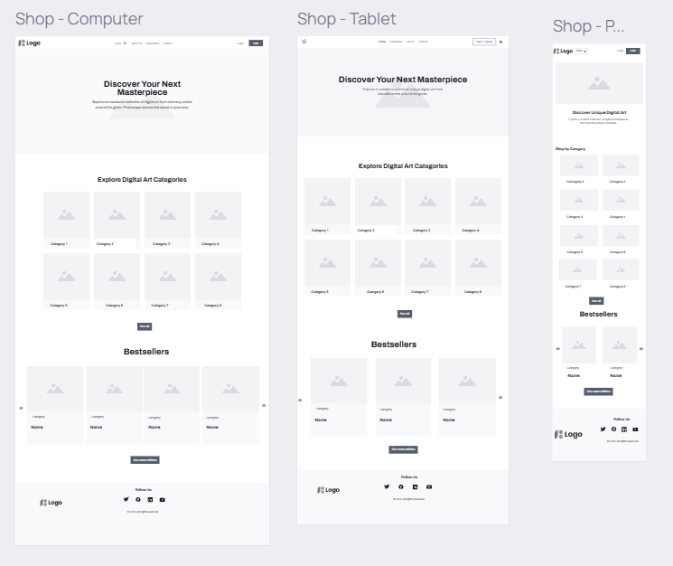

**Design Principles**
- **Visual hierarchy first** – large artwork previews, clear pricing, structured information blocks  
- **Consistent spacing & alignment** across desktop, tablet, and mobile  
- **Minimal color palette** to ensure artwork stands out  
- **Mobile-first**, then progressively enhanced for larger screens  
- **Simple interactions** – toasts, dropdowns, small dynamic updates (price changes by size)

---

## Features

### Navigation
- A clean, fixed navigation bar available on all pages for quick access.  
- Includes links to **Shop**, **Bag**, **Library**, **Profile**, **Login/Logout/Register** and **Search** depending on authentication state.  
- Fully responsive — collapses into a compact mobile menu for small screens.  
- The Artera logo always leads back to the homepage.

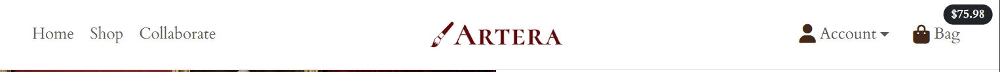  
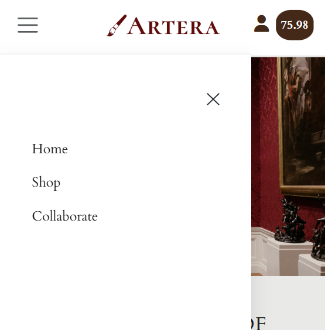

---

### Footer
- Minimal, clean footer displayed on all pages.  
- Contains links to essential sections such as **Shop**, **Profile**, **Library**, and **Contact** (if enabled).  
- Shows social links or brand mentions when needed (Instagram, website).  
- Includes essential legal links like Terms & Conditions and Privacy Policy for user clarity and trust.


### Homepage
- Hero section introducing Artera and highlighting the platform’s purpose: discovering and downloading high-quality digital artwork.  
- Clean layout showcasing featured artworks and category highlights.  
- Clear calls to action directing users to **Browse Artworks**, **Sign In / Create Account** and **Newsletter**.  
- Designed to feel minimal, gallery-like, and easy to explore.

  
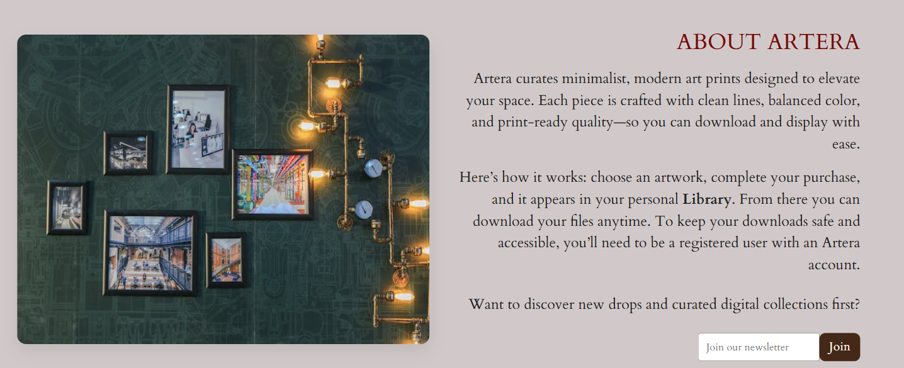
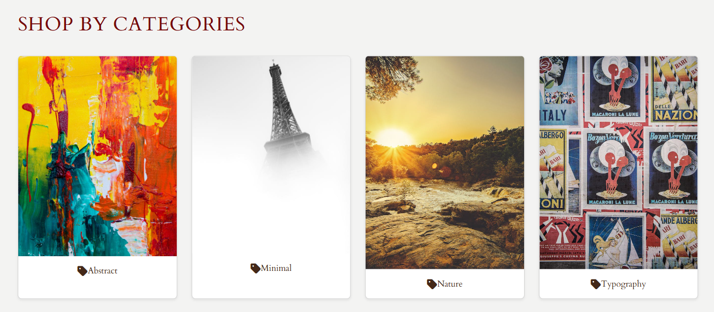

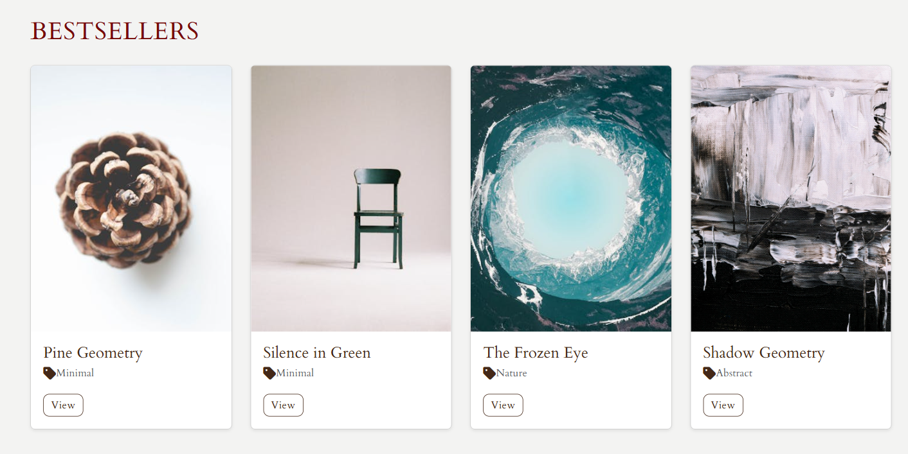

---

### Shop Page
- Grid-based layout displaying artworks with title, price, and preview image.  
- Search bar allowing users to look up artworks by keyword.  
- Category list to filter artworks.  
- Randomized artwork list to show new print everytime.

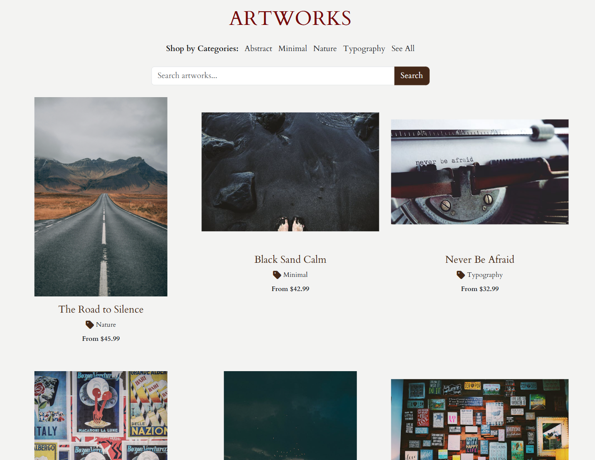

---

### Artwork Detail Page
- Large artwork preview with title, description, and base price.  
- **Dynamic size selector** updates final price instantly based on the surcharge logic.  
- “Add to Bag” button triggers a toast notification and updates the cart count.  
- Clean, minimal layout focused on the artwork itself.

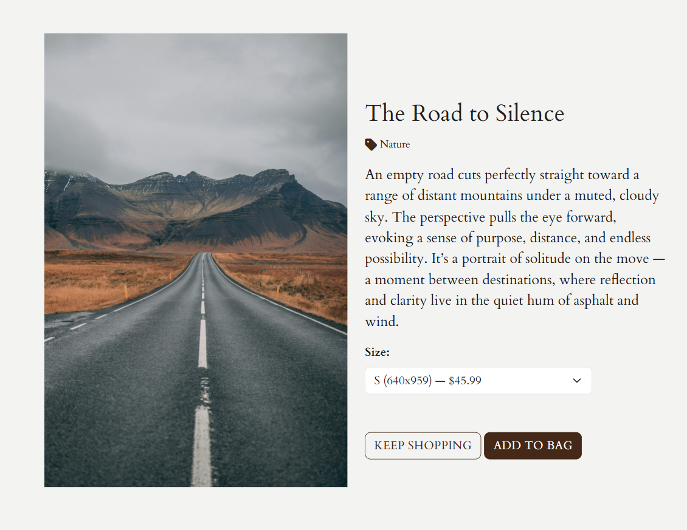

---

### Shopping Bag
- Session-based shopping cart storing:  
  - Artwork  
  - Selected size  
  - Calculated price  
- Users can remove items.  
- Bag total updates automatically.  
- Checkout button redirects to the secure Stripe payment page.

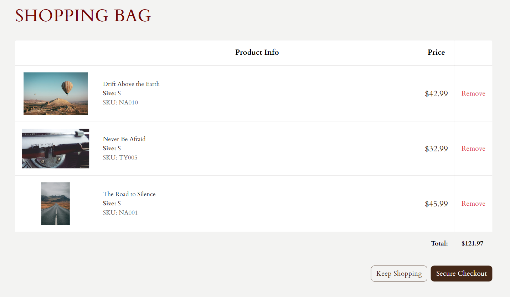


---

### Checkout
- Stripe PaymentIntent integration for secure payment handling.  
- Collects delivery details (full name, address, phone, etc.).  
- Option to save delivery info to Profile for future orders.  
- On successful payment, Stripe webhook confirms and creates the Order + Order Items.

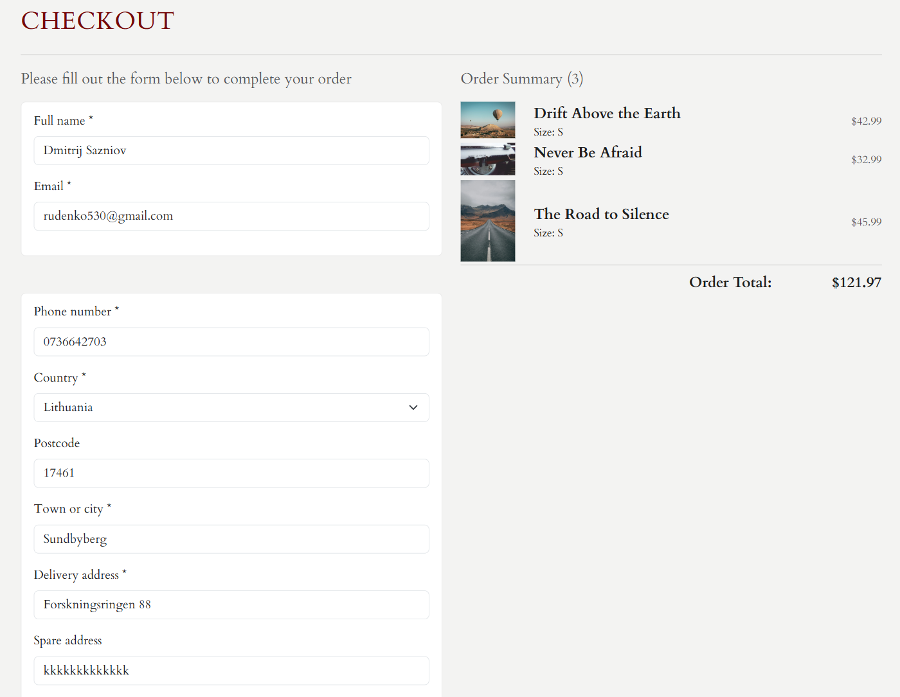
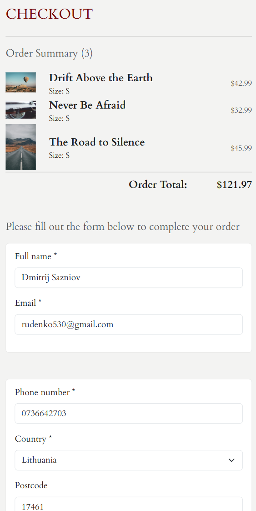

---

### Checkout Success (Order Confirmation)
- Shown immediately after a successful Stripe payment.  
- Displays a clear thank-you message and the **order number** for reference.    
- Provides a direct **“Go to Library”** button so users can download their files right away.  

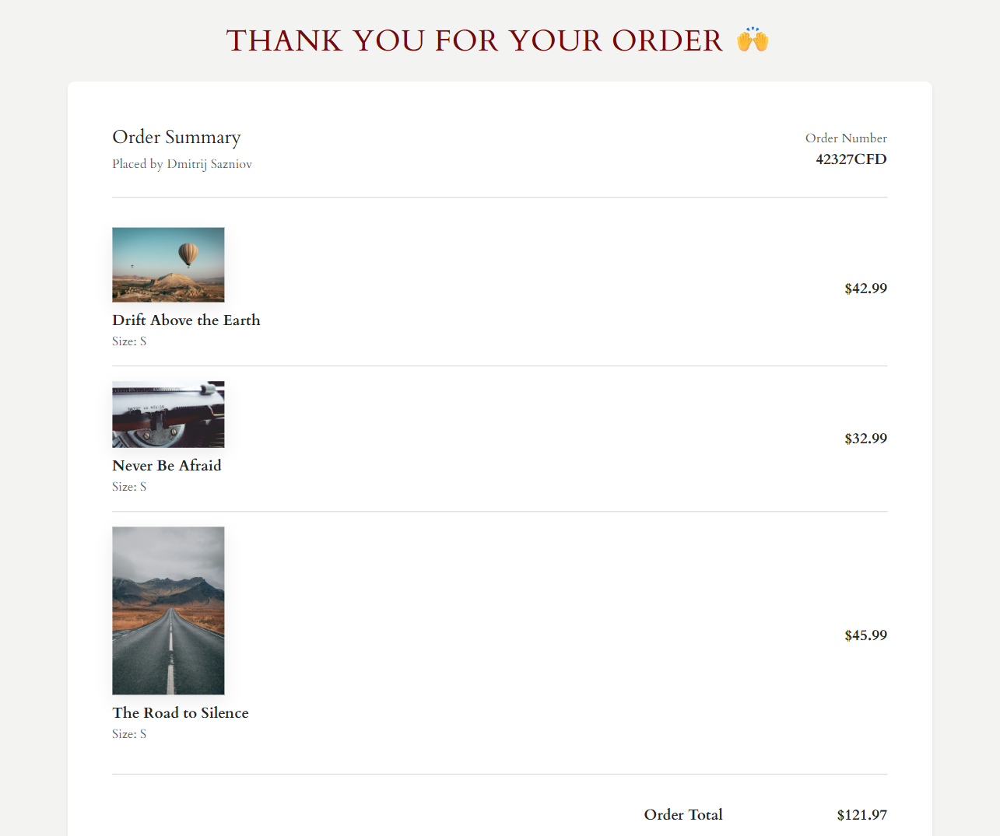

---

### Digital Library
- Logged-in users can access a personal library containing all purchased artworks.  
- Each entry shows artwork title, preview image, size purchased, and download link.  
- Only the purchasing user (email match) can access their files.
- Also displays all custom artwork requests submitted by the user.
- Each request card includes a “Manage” button that opens the full request detail page for status updates and file previews.

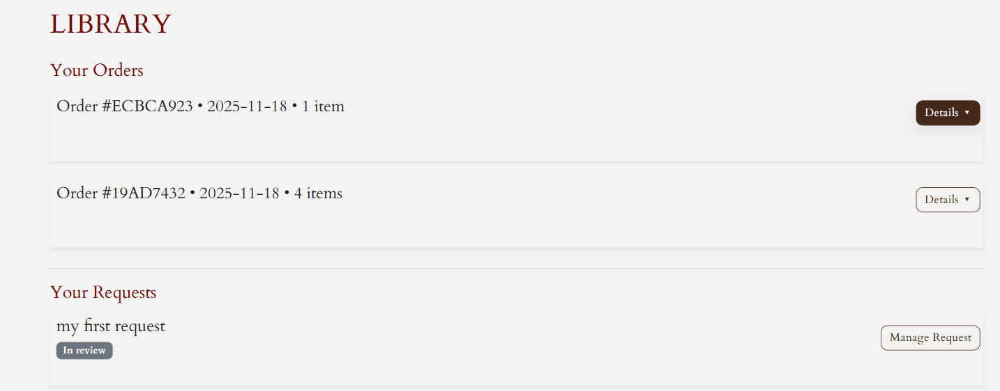
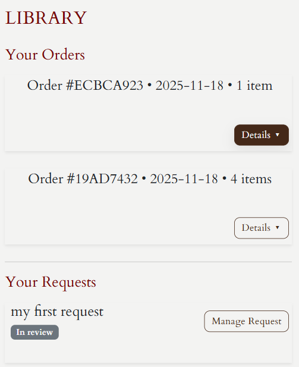

---

### Profile Page
- Users can update personal information:  
  - Full name  
  - Phone number  
  - Address (delivery & living)  
  - City, postal code, country
  - Email
  - Username
- Avatar upload/remove integrated via Cloudinary.  
- Profile details auto-populate during checkout when “Save Delivery Info” is enabled.

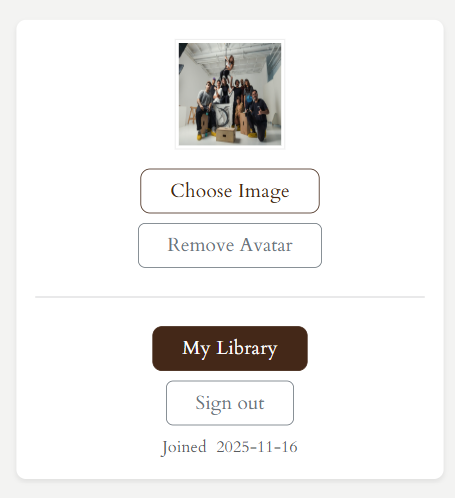  
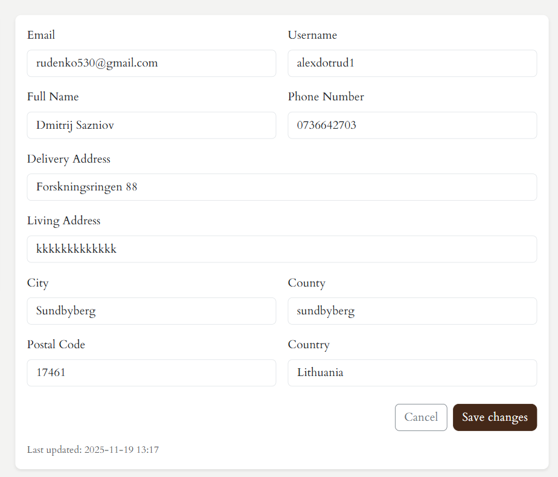

---

### Artwork Requests
- Users can submit a **custom artwork request** with:  
  - Title  
  - Description  
  - Reference image  
- Each request appears in the user’s Library page with a status badge (in review / accepted / rejected).  
- Admin can update the request status through Django Admin.

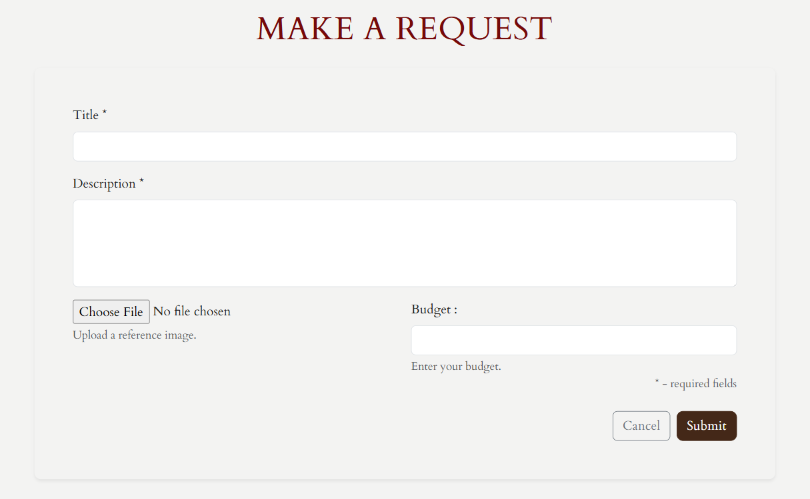

---

### Request Detail (Custom Artwork Requests)
- Accessible from the **Library** page via the **“Manage Request”** button.  
- Shows the full details of a single **Artwork Request**, including:  
  - Title  
  - Description  
  - Status badge (In review / Accepted / Rejected)  
  - Optional reference image (if provided)  
- Allows users to review the current status of their custom piece and see what they previously submitted.  
- May include action buttons such as **Edit Request** or **Delete Request** (with confirmation modal) depending on business rules.


---

### Artwork Offers (Artist Submissions)
- Artists can offer their work by submitting:  
  - Full name  
  - Email  
  - Title  
  - Description  
  - Sample image  
  - Optional website/Instagram  
- Stored in the database and visible in Django Admin for review.

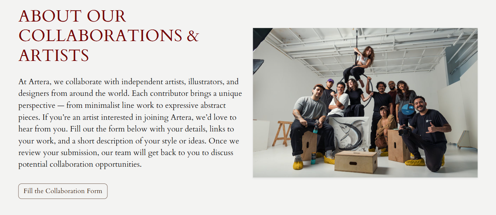
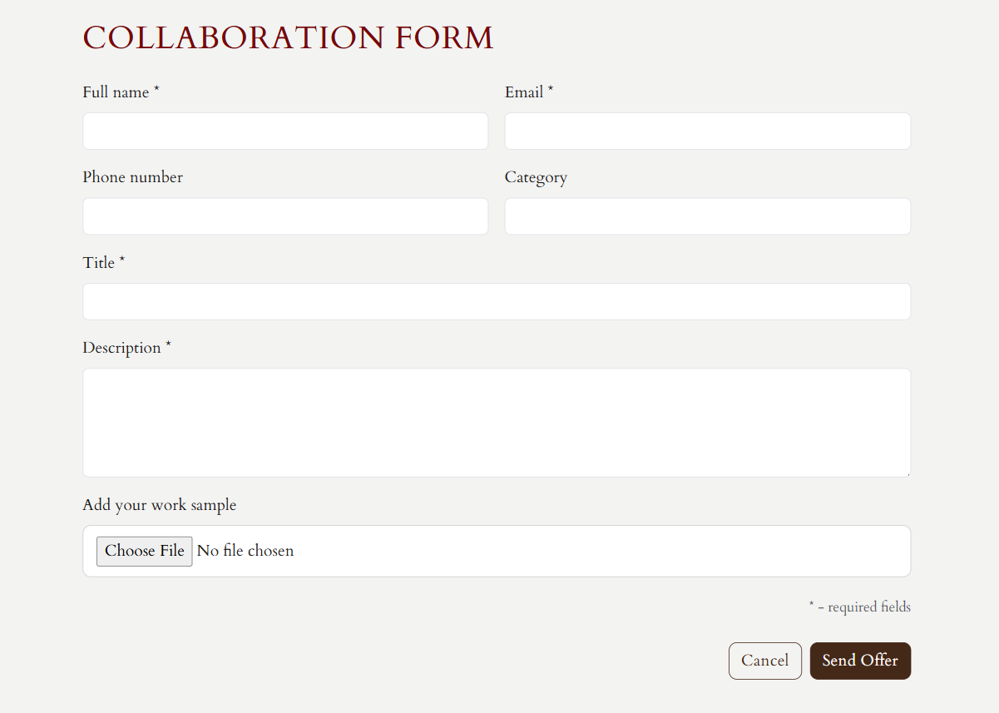

---

### Offer Success (Artist Submission Confirmation)
- Shown after an artist successfully submits an **Artwork Offer** form.  
- Confirms that the submission was received by the Artera team.  
- Briefly explains that the work will be reviewed and the artist may be contacted if it fits the collection.  
- Provides a **Submit Another** and **Browse Artworks** buttons to continue browsing.  

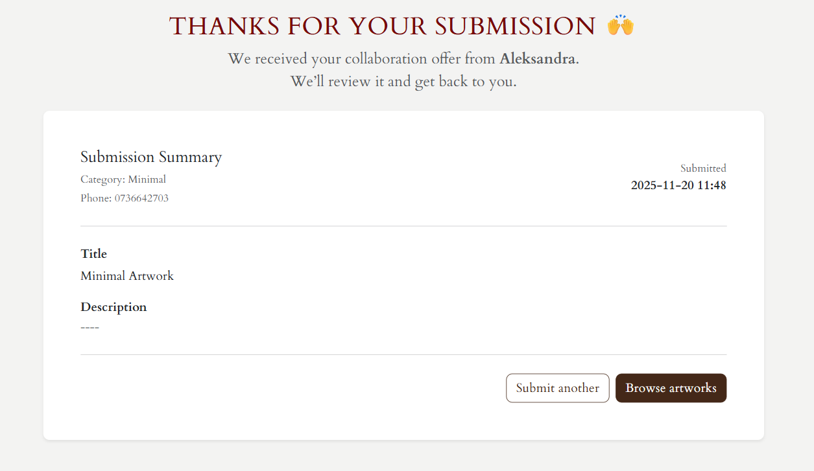

---

### 404 Error Handling (Defensive Design)
- Friendly error page matching ARTERA branding.  
- Suggests returning to the homepage.

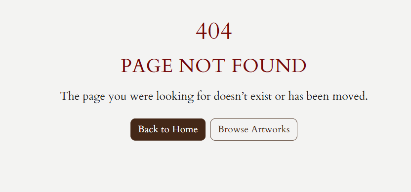  

---

## UX Design
The UX strategy for Artera focuses on **simplicity, elegance, and a gallery-like browsing experience**.  
Every design decision supports clarity, high-quality artwork presentation, and frictionless shopping.

The interface avoids clutter, emphasizes large visuals, and uses subtle interactions to guide the user through browsing, selecting, purchasing, and downloading artwork.

---

### Colors and Theme
Artera uses a minimal, modern color palette to keep attention on the artwork while maintaining a premium feel.

**Color Scheme:**


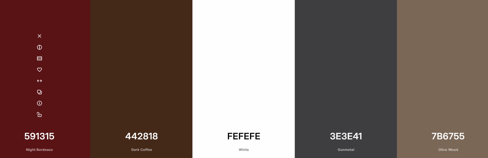

The overall theme is intentionally minimal so that the artwork itself becomes the visual centerpiece.

---

### Fonts
- **Primary Font:** "Cardo", serif - easy readarble, modern; 

Typography stays neutral and spacious, creating a refined, gallery-like atmosphere.

---

### Effects and Interactions
Artera uses lightweight animations and subtle UI feedback to enhance the shopping flow without overwhelming the user.

- **Dynamic Price Updates**
  - Changing artwork size updates price instantly.
  - Smooth fade/slide transitions emphasize the update.

- **Toast Notifications**
  - “Added to Bag” appears as a small toast with fade-in/out animation.
  - Non-intrusive but clearly visible.

- **Hover Effects**
  - Artwork cards slightly scale up or brighten on hover.
  - Buttons darken or lighten subtly to show interactivity.

- **Responsive Layout Adjustments**
  - On mobile, artwork grids collapse into single-column layouts.
  - Bag, Library, and Profile forms stack vertically for easy thumb navigation.

- **Stripe Interaction Feedback**
  - Loading spinners show when redirecting to Stripe.
  - Clear confirmation and failure states after returning from checkout.

- **Status Badges**
  - Color-coded labels for artwork request status:
    - **In Review** – neutral gray  
    - **Accepted** – green  
    - **Rejected** – red  

- **Form Validation**
  - All forms provide immediate error messages (empty fields, invalid email, etc.).
  - Disabled buttons for incomplete submissions.

- **Avatar Upload Interaction**
  - User gets a clear preview before saving.
  - Delete option immediately removes the Cloudinary image.

- **Randomized Artwork Display**
  - The shop page loads artworks in a randomized order each time.
  - Helps expose customers to a wider range of designs and increases discovery-driven sales.

- **Modals for Confirmation**
  - Deleting avatars, requests, or profile data uses Bootstrap confirmation modals.
  - Prevents accidental actions and provides a consistent interaction pattern across the site.

Overall, UI interactions are deliberately **calm, predictable, and performance-friendly**, supporting the platform’s visual identity as a clean digital art marketplace.

---

## Technologies Used

### Languages  
- **HTML** — Structures all page templates, including product listings, forms, navigation, and layout components.  
- **CSS** — Provides styling for the entire site, ensuring a clean, modern gallery look.  
- **CSS Variables** — Used to maintain consistent colors, spacing, and typography across all pages.  
- **CSS Flexbox & Grid** — Power the responsive layouts used in the Shop, Bag, Library, and Profile pages.  
- **JavaScript (Vanilla)** — Handles dynamic price updates, toast notifications, size selection logic, and small frontend interactions.  
- **jQuery** — Used for quick DOM manipulation, AJAX toasts, and a few Bootstrap-dependent interactions.
- **Python** — The primary backend language powering all server-side logic, views, URL routing, and integrations.

---

### Frameworks & Libraries  
- **Bootstrap 5** — Provides a responsive grid system and polished UI components (forms, buttons, cards, modals).  
- **Django** — Core backend framework handling views, routing, templates, models, authentication, and admin.  
- **Django Allauth** — Manages user authentication, login, registration, and email verification.  
- **Stripe** — Secure payment processing and order confirmation.
- **Cloudinary** — Handles image storage, optimization, and delivery for artwork files and user avatars.  
- **Font Awesome** — Supplies iconography for UI buttons and status badges.  
- **Google Fonts** — Integrates the typography used across the platform (e.g., Inter).  
- **Pillow** — Image processing for uploaded artwork/avatars.

---

### Databases  
- **PostgreSQL ( production )** — Stores all users, artworks, orders, order items, requests, and offers.  
- **SQLite ( development )** — Lightweight database for local development before deployment.  

---

### Other Tools & Services  
- **Git** — Version control used throughout the development process.  
- **GitHub** — Repository hosting, issues, and project management.  
- **Heroku** – Deployment platform hosting the live Artera application. 
- **SendGrid** — Handles account verification emails and notification messages.  
- **Stripe Dashboard** — Used to monitor payments, test transactions, and view webhook logs.  
- **Cloudinary Dashboard** — Manages all artwork files and user avatars stored in the cloud.  
- **VS Code** — Primary development editor with extensions for Django, Git, and formatting.  
- **Python Beautifier / Formatter (Black)** — Ensures clean, consistent Python formatting across the project.  
- **dbdiagram.io** — Used to design and visualize the app’s data architecture.  
- **W3C HTML Validator** — Ensures semantic and accessible HTML.  
- **W3C CSS Validator** — Validates stylesheet structure and standards compliance.  
- **CI Python Linter** — Automated checking of Python syntax and code style.  
- **Image Optimization Tools** — Used to compress artwork files to improve loading performance across the site. 


## Testing
Automated and manual testing were performed across the core apps of Artera to ensure stability, correctness, and a smooth user experience.

### Automated Tests

Automated tests cover core backend logic, model behavior, and access permissions in the main Django apps.

#### **Shop app**
- Basic tests confirm that the artwork list and detail views load correctly, return the expected templates, and display test content. Test with: python manage.py test shop

#### **Bag app**
- Tests check that items can be added to and removed from the bag, and that session data and redirects behave as expected. Test with: python manage.py test bag

#### **Checkout app**
- Lightweight tests ensure the checkout page loads when the bag contains items and that the correct template is used. Test with: python manage.py test checkout

#### **Profiles app**
- Tests verify that profile and library pages enforce authentication, load correctly for logged-in users, and display user-related data. Test with: python manage.py test profiles

---

| **User Stories Testing**                                                   | **Result** | **Status** |
| -------------------------------------------------------------------------- | ---------- | ---------- |
| User can sign up, log in, and log out successfully.                        | Pass       | ✅          |
| Only logged-in users can access Bag, Checkout, Library, and Profile pages. | Pass       | ✅          |
| User can browse shop, search artworks, and filter by category.             | Pass       | ✅          |
| Artwork detail page loads correctly with dynamic price change by size.     | Pass       | ✅          |
| User can add items to Bag and see toast confirmation.                      | Pass       | ✅          |
| User can remove items from the Bag.                                        | Pass       | ✅          |
| Bag total updates correctly with size surcharge included.                  | Pass       | ✅          |
| Checkout requires all required fields; validation errors appear clearly.   | Pass       | ✅          |
| Stripe checkout flow completes; user returns to success page.              | Pass       | ✅          |
| Failed Stripe payment returns user to cancel page.                         | Pass       | ✅          |
| Successful payment triggers webhook and marks order as **paid**.           | Pass       | ✅          |
| Library shows only purchased artworks for the logged-in user.              | Pass       | ✅          |
| Users cannot access downloads of other users.                              | Pass       | ✅          |
| Profile updates save correctly (address, phone, avatar).                   | Pass       | ✅          |
| Avatar upload/remove updates Cloudinary as expected.                       | Pass       | ✅          |
| Users can create Artwork Requests with title, description, and image.      | Pass       | ✅          |
| Request appears in Library with correct status.                            | Pass       | ✅          |
| Artists can submit Artwork Offers with sample image.                       | Pass       | ✅          |
| Admin can change status of Requests in Django Admin.                       | Pass       | ✅          |
| 404 page displays for non-existent routes.                                 | Pass       | ✅          |


| **Test**                       | **Description**                         | **Result** | **Status** |
| ------------------------------ | --------------------------------------- | ---------- | ---------- |
| Sign-up with valid data        | Creates user and logs them in.          | Pass       | ✅          |
| Duplicate username/email       | Shows field error.                      | Pass       | ✅          |
| Password mismatch              | Shows field error.                      | Pass       | ✅          |
| Login with valid credentials   | Redirects to homepage.                  | Pass       | ✅          |
| Login with invalid credentials | Shows error message.                    | Pass       | ✅          |
| Logout                         | Ends session and redirects to homepage. | Pass       | ✅          |


| **Test**              | **Description**                          | **Result** | **Status** |
| --------------------- | ---------------------------------------- | ---------- | ---------- |
| Update profile fields | Saves address, phone, and personal info. | Pass       | ✅          |
| Upload avatar         | Cloudinary image is saved and displayed. | Pass       | ✅          |
| Remove avatar         | Avatar resets to default placeholder.    | Pass       | ✅          |
| Invalid fields        | Show validation errors.                  | Pass       | ✅          |


| **Test**                | **Description**                           | **Result** | **Status** |
| ----------------------- | ----------------------------------------- | ---------- | ---------- |
| Shop loads all artworks | Thumbnails, titles, and prices appear.    | Pass       | ✅          |
| Search bar              | Returns correct artwork results.          | Pass       | ✅          |
| Category filter         | Filters artworks correctly.               | Pass       | ✅          |
| Artwork detail          | Loads full description and size selector. | Pass       | ✅          |
| Price updates by size   | Correct surcharge applied.                | Pass       | ✅          |


| **Test**                    | **Description**                         | **Result** | **Status** |
| --------------------------- | --------------------------------------- | ---------- | ---------- |
| Add to bag                  | Adds item with size/qty=1.              | Pass       | ✅          |
| Remove item                 | Item removed instantly.                 | Pass       | ✅          |
| Bag persists during session | Items remain until checkout or removal. | Pass       | ✅          |


| **Test**                     | **Description**             | **Result** | **Status** |
| ---------------------------- | --------------------------- | ---------- | ---------- |
| Required fields validation   | Missing fields show errors. | Pass       | ✅          |
| Stripe redirect              | Works reliably.             | Pass       | ✅          |
| Payment success              | Redirects to success page.  | Pass       | ✅          |
| Webhook updates order status | Marks order as **paid**.    | Pass       | ✅          |


| **Test**                           | **Description**                                  | **Result** | **Status** |
|------------------------------------|--------------------------------------------------|------------|--------|
| Library loads purchased artworks   | Correct items with download links.               | Pass       | ✅     |
| Unauthorized access                | Users can't view others’ downloads.              | Pass       | ✅     |
| Shows correct artwork previews     | Artwork thumbnail or fallback image loads.       | Pass       | ✅     |
| Collapsible order sections         | Users can expand/collapse order items.           | Pass       | ✅     |
| Artwork Request list rendering     | Requests appear under “Your Requests” section.   | Pass       | ✅     |
| Request status badges              | Shows correct badge (In review / Accepted / Rejected). | Pass | ✅ |
| Manage Request button              | Button links to the correct request detail page. | Pass       | ✅     |
| Empty Library state                | Shows correct message + CTA when no orders exist.| Pass       | ✅     |
| Empty Requests state               | Shows correct message + CTA when no requests exist. | Pass    | ✅ |
---

#### Lighthouse Report

[Lighthouse report](documentation/lighthouse.pdf)

Lighthouse classifies these as third-party cookies and reduces the best practices score.

---

### Compatibility

To confirm correct functionality, layout stability, and responsive behavior, Artera was tested across the following browsers:

- **Google Chrome**

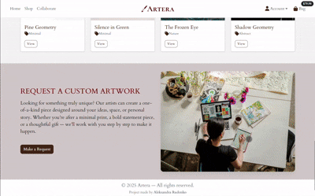

- **Mozilla Firefox**

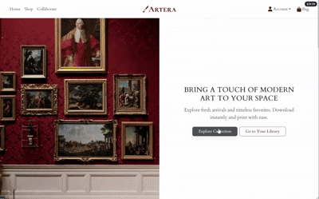

- **Microsoft Edge**

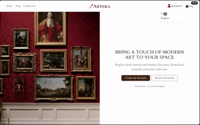

All major browsers showed consistent behavior in navigation, checkout flow, responsiveness, and interactive components.

---

### Responsiveness

Artera’s responsiveness was verified using the **Responsive Viewer** extension in Google Chrome, ensuring layouts adapt correctly across mobile, tablet, and desktop breakpoints.

[Responsiveness report](documentation/Responsivness.pdf)

---

### Validator Testing

#### HTML  
All templates were checked using the W3C HTML Validator.  

[HTML Report](documentation/html-validator.pdf)

#### CSS  
Validated using the W3C CSS Validator.

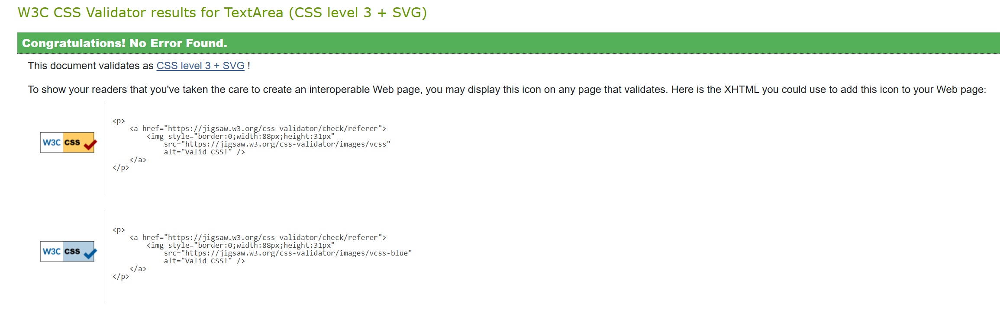

#### JavaScript  
Validated using the JS Hint.

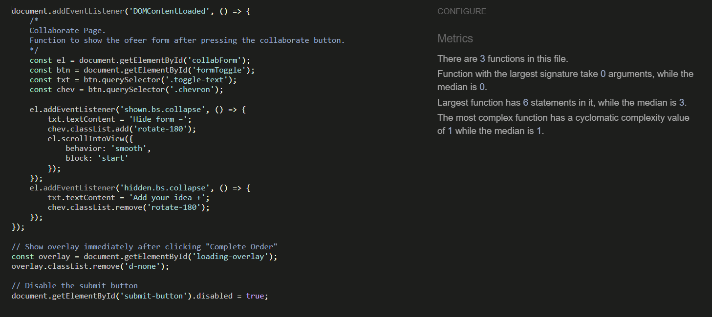

#### Python   
Python code was validated using **CI Python Linter**.  

[Python Validation Report](documentation/python-validator.pdf)

---

## Bugs

### Solved Bugs

#### Session Bag Logic Errors
- **Issue:** Size and quantity updates weren’t reflected after page reload.
- **Cause:** Session dictionary keys were inconsistent between views and templates.
- **Fix:** Standardized session key naming and ensured updates triggered a session save event.

---

#### Stripe PaymentIntent Issues
- **Issue:** Orders were created even when payment failed.
- **Cause:** Missing webhook validation on `payment_intent.succeeded`.
- **Fix:** Implemented full webhook validation, ensuring orders are marked *paid* only on successful Stripe confirmation.

---

#### Profile Avatar Errors (Cloudinary)
- **Issue:** Removing an avatar caused a broken image reference.
- **Cause:** Cloudinary public_id wasn’t being deleted.
- **Fix:** Added `cloudinary.uploader.destroy(public_id)` before clearing the avatar field.

---

#### Artwork Request Status not Updating
- **Issue:** User-facing status badges did not reflect Admin updates.
- **Fix:** Adjusted queryset to pull fresh status on each page load.

---

#### Incorrect Price Calculation on Artwork Detail Page
- **Issue:** Changing size sometimes used outdated surcharge values.
- **Cause:** Missing fallback in JS for empty or incorrect size attributes.
- **Fix:** Added validation and safe defaults before recalculating.

---

### Unfixed / Known Bugs
- **Email deliverability issue:** Some transactional emails (including verification emails) are currently landing in spam.

- **Inline CSS in email templates:** All custom email templates rely on inline styles because external CSS files were not being applied.
## Future Changes

Artera has a strong foundation, but several improvements are planned to expand functionality, enhance user experience, and support business growth. These future features would shift the project from a simple art store into a full digital art marketplace.

## Future Changes

- **Artist Dashboard**  
  A dedicated dashboard where artists can manage submissions, track offer status, and upload new artwork collections.

- **Admin Analytics Panel**  
  Sales charts, artwork performance stats, top downloads, and monthly revenue insights.


- **Advanced Search & Smart Filtering**  
  Users will be able to filter by:  
  - orientation  
  - color palette  
  - style (minimalist, vintage, abstract, etc.)  
  - tags  
  - price range  

- **Wishlist / Favorites**  
  Users can bookmark items they want to view or purchase later.

- **Discount Codes & Promotions**  
  Add support for coupon codes, launch promotions, and limited-time sales.

- **User Reviews & Ratings**  
  Customers will be able to leave reviews on purchased artworks. Reviews will display the user's profile image (from their profile avatar), rating, and comment to build trust and showcase authentic buyer feedback.

---

## Deployment

Artera is deployed on **Heroku**, using manual deployments via the Heroku Dashboard. This method allows predictable, controlled releases without requiring GitHub Actions or CI/CD pipelines.

### Deployment Steps (Heroku)

1. **Create the Heroku App**  
   Go to Heroku → **New → Create New App**  
   Choose app name + region (EU recommended).

2. **Add Required Buildpacks**
   - `heroku/python`
   - `heroku/nodejs` (required for Stripe Elements)

3. **Connect Repository**
   - Go to **Deploy** → Select **GitHub**
   - Connect your repository  
   - (Optional) Enable Automatic Deploys from the main branch

4. **Add Config Vars (Environment Variables)**
   In **Settings → Reveal Config Vars**, add:

   - `SECRET_KEY`
   - `DATABASE_URL`
   - `STRIPE_PUBLIC_KEY`
   - `STRIPE_SECRET_KEY`
   - `STRIPE_WH_SECRET`
   - `CLOUDINARY_URL`
   - `HEROKU_APP_URL`
   - Email credentials (SendGrid)
   - Any other private keys

5. **Prepare Django for Deployment**
   Make sure your repository contains:
   - `Procfile`
   - `requirements.txt`
   - `staticfiles` settings configured properly  
   - `DEBUG = False` in production  

6. **Run Migrations**  
   - Open the **More > Run Console** option in the top-right corner.  
   - Run the following commands:  

     ```bash
     python manage.py makemigrations
     python manage.py migrate
     python manage.py createsuperuser
     python manage.py collectstatic --noinput
     ``` 

7. **Manually Deploy the App**  
   - Scroll down to the **Manual Deploy** section and click **Deploy Branch** to deploy your app.  

### Security

Several security measures were implemented to ensure safe development, deployment, and user data handling throughout the Artera platform:

- **Environment Variables**  
  All sensitive values (`SECRET_KEY`, `STRIPE_SECRET_KEY`, `DATABASE_URL`, `CLOUDINARY_URL`, email credentials, etc.) are stored in **Heroku Config Vars** and never committed to GitHub.

- **Production Safety Settings**  
  `DEBUG = False` in production prevents sensitive debug output.

- **Allowed Hosts**  
  Restricted to the Heroku domain and localhost for development.

- **Authentication & Password Security**  
  Django’s built-in authentication handles password hashing, session security, and CSRF protection.

- **Secure Payments**  
  Stripe processes all payments externally using HTTPS, and all order confirmations rely on signed, verified webhooks.

- **Form Validation**  
  Both client-side and server-side validation ensures safe and clean input across all forms (checkout, profile, submissions, etc.).

- **Static & Media Security**  
  User-uploaded images are stored securely through Cloudinary with generated URLs and backend validation.

---

### Testing the Deployment

After deploying the application to Heroku, all major components were manually tested using the production URL: https://artera-d6829bf39792.herokuapp.com/.


The following deployment checks were completed:

- All pages load correctly with no missing static files  
- Stripe checkout flow works with redirect + webhook confirmation  
- Cloudinary image uploads and deletions function correctly  
- Bag/session logic functions as expected  
- Digital Library downloads only accessible to the purchasing user  
- All forms validate properly  
- 404 and other error pages display correctly  
- No console errors or missing assets in production  

---

## Cloning, Forking and Version Control

### Cloning

To clone the repository:

- On GitHub.com, navigate to the main page of the repository.  
- Above the list of files, click **Code**.  
- Copy the URL for the repository.  
- Type `git clone`, and then paste the URL you copied earlier.  
- Press **Enter** to create your local clone.  
- Move into the newly created project directory:  
  ```bash
  cd your-repository-name
  ```

---

### Forking

To fork the repository:

- On GitHub.com, navigate to the main page of the repository.  
- In the top-right corner of the page, click **Fork**.  
- Under "Owner," select the dropdown menu and choose where to create the fork.  
- Click **Create Fork**.  
- Once created, clone your fork locally.

---

### Version Control

The project was developed using Git for version control and GitHub for remote storage.  
- Development was done in small, frequent commits to make progress traceable and manageable.  
- Commit messages were written to be descriptive and meaningful.  
- Branching was used for new features and bug fixes, which were merged back into the main branch after testing.  
This ensured clear project history and easier debugging when issues occurred.

---

## Credits

### Tools & Libraries
- **Font Awesome** – Icons used throughout the user interface.  
- **Google Fonts** – Typography resources for clean, modern styling.  
- **dbdiagram.io** – Used to design and visualize the final database schema.  
- **Coolors** – Generated the color palette for the project.  
- **Responsive Viewer Chrome Extension** – Checked responsiveness on multiple device sizes.  
- **Chrome DevTools / Lighthouse** – Performance, accessibility, and SEO testing.  
- **W3C Validators** – HTML and CSS validation.  
- **CI Python Linter** – Ensured PEP 8 compliance for cleaner backend code.  
- **ImageResizer.com** – Resized and optimized images for performance and documentation.  
- **iLovePDF** – Converted PowerPoint assets into PDF format.  
- **PowerPoint** – Used to create presentation visuals included in documentation.

### Learning Resources
- **Django Documentation** – Primary reference for backend architecture.  
- **Stripe Documentation** – Guidance for payment flows and webhooks.  
- **Cloudinary Documentation** – Used to implement avatar and artwork image handling.  
- **Code Institute** – General inspiration for structure, testing approach, and methodology.  
- **W3Schools** – Quick reference for HTML, CSS, and JavaScript patterns.  
- **Stack Overflow** – Troubleshooting and solutions for development challenges.  
- **Master Django & Python for Web Development (YouTube)** – Used to deepen Django understanding.  

### Media & Content
- **Favicon & Logo** – Created with (https://favicon.io/).   
- **Text & Documentation** – All content and copywriting created by the project author.  
- **Artwork / Placeholder Images** – Sourced from royalty-free libraries such as **Pexels** and **Pixabay**.  
- **Favicon & Logo** – Generated using **favicon.io**.  
- **README Screenshots** – Captured with **Responsive Viewer** and optimized with **ImageResizer.com**.  